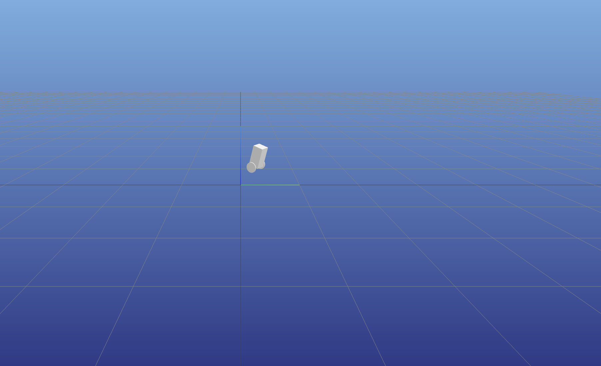

# Segway MIPSI Visualization
## Instructions
1. Install the following python packages
```
pip3 install numpy
pip3 install pandas
pip3 install meshcat
```
2. Copy your ODE.1 file into this directory. Make sure your MG code outputs the variables in the following order: `Output t sec, qA deg, qB deg, qA' deg/sec, qB' deg/sec, vx m/s, TC N*m, TD N*m, x m, y m`
3. `cd` into this directory
4. Run the visualizer `python3 mipsi_viz.py`
6. Go to the URL printed to Terminal/Command Prompt to see the 3D visualization. The URL should be something similar to `http://127.0.0.1:7033/static/`. It should look something like:


